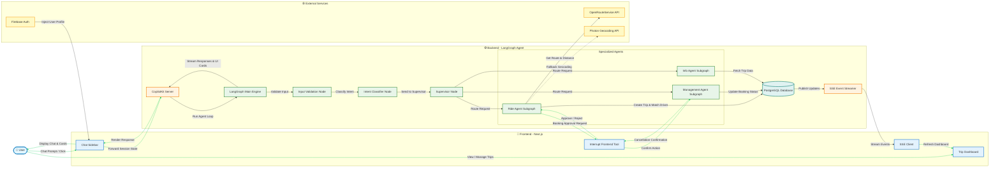

```mermaid
---
config:
  look: classic
  theme: mc
---
graph LR
    User([👤 User])

    subgraph frontend["🎨 Frontend - Next.js"]
        ChatSidebar["Chat Sidebar"]
        TripDashboard["Trip Dashboard"]
        SSEListener["SSE Client"]
        InterruptTool["Interrupt Frontend Tool"]
    end

    subgraph backend["⚙️ Backend - LangGraph Agent"]
        CopilotKitServer["CopilotKit Server"]
        MainAgentGraph["LangGraph Main Engine"]
        InputValidation["Input Validation Node"]
        IntentClassifier["Intent Classifier Node"]
        Supervisor["Supervisor Node"]

        subgraph Subagents["Specialized Agents"]
            RideAgent["Ride Agent Subgraph"]
            ManagementAgent["Management Agent Subgraph"]
            InfoAgent["Info Agent Subgraph"]
        end

        PostgresDB[(PostgreSQL Database)]
        SSEHub["SSE Event Streamer"]
    end

    subgraph external["🌐 External Services"]
        FirebaseAuth["Firebase Auth"]
        ORS_API["OpenRouteService API"]
        Photon_API["Photon Geocoding API"]
    end

    User -->|Chat Prompt / Click| ChatSidebar
    User -->|View / Manage Trips| TripDashboard

    FirebaseAuth -->|Inject User Profile| ChatSidebar

    ChatSidebar -->|Forward Session State| CopilotKitServer
    CopilotKitServer -->|Run Agent Loop| MainAgentGraph

    MainAgentGraph -->|Validate Input| InputValidation
    InputValidation -->|Classify Intent| IntentClassifier
    IntentClassifier -->|Send to Supervisor| Supervisor

    Supervisor -->|Route Request| RideAgent
    Supervisor -->|Route Request| ManagementAgent
    Supervisor -->|Route Request| InfoAgent

    RideAgent -->|Get Route & Distance| ORS_API
    RideAgent -.->|Fallback Geocoding| Photon_API
    RideAgent -->|Booking Approval Request| InterruptTool
    InterruptTool -->|Approve / Reject| RideAgent
    RideAgent -->|Create Trip & Match Driver| PostgresDB

    ManagementAgent -->|Cancellation Confirmation| InterruptTool
    InterruptTool -->|Confirm Action| ManagementAgent
    ManagementAgent -->|Update Booking Status| PostgresDB

    InfoAgent -->|Fetch Trip Data| PostgresDB

    PostgresDB -->|Publish Updates| SSEHub
    SSEHub -->|Stream Events| SSEListener
    SSEListener -->|Refresh Dashboard| TripDashboard

    MainAgentGraph -->|Stream Responses & UI Cards| CopilotKitServer
    CopilotKitServer -->|Render Response| ChatSidebar
    ChatSidebar -->|Display Chat & Cards| User

    classDef frontend fill:#E3F2FD,stroke:#1976D2,stroke-width:2px
    classDef backend fill:#E8F5E9,stroke:#388E3C,stroke-width:2px
    classDef apiNode fill:#FFF3E0,stroke:#F57C00,stroke-width:2px
    classDef databaseNode fill:#E0F2F1,stroke:#00796B,stroke-width:2px
    classDef appNode fill:#E1F5FE,stroke:#0277BD,stroke-width:2px
    classDef externalNode fill:#FFF9C4,stroke:#F9A825,stroke-width:2px

    class User appNode

    class ChatSidebar frontend
    class TripDashboard frontend
    class SSEListener frontend
    class InterruptTool frontend

    class CopilotKitServer apiNode
    class SSEHub apiNode

    class MainAgentGraph backend
    class InputValidation backend
    class IntentClassifier backend
    class Supervisor backend
    class RideAgent backend
    class ManagementAgent backend
    class InfoAgent backend

    class PostgresDB databaseNode

    class FirebaseAuth externalNode
    class ORS_API externalNode
    class Photon_API externalNode

    linkStyle 0 stroke:#00C853
    linkStyle 1 stroke:#00C853
    linkStyle 3 stroke:#00C853
    linkStyle 13 stroke:#00C853
    linkStyle 14 stroke:#00C853
    linkStyle 16 stroke:#00C853
    linkStyle 17 stroke:#00C853
    linkStyle 22 stroke:#00C853
    linkStyle 24 stroke:#00C853
    linkStyle 25 stroke:#00C853
```
